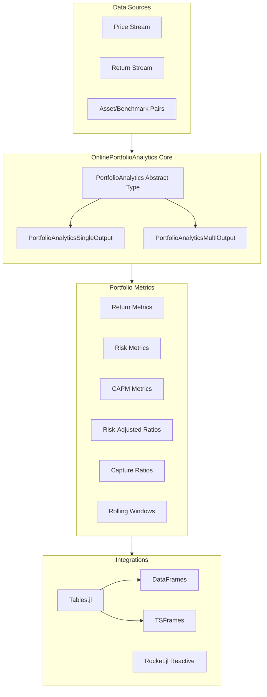
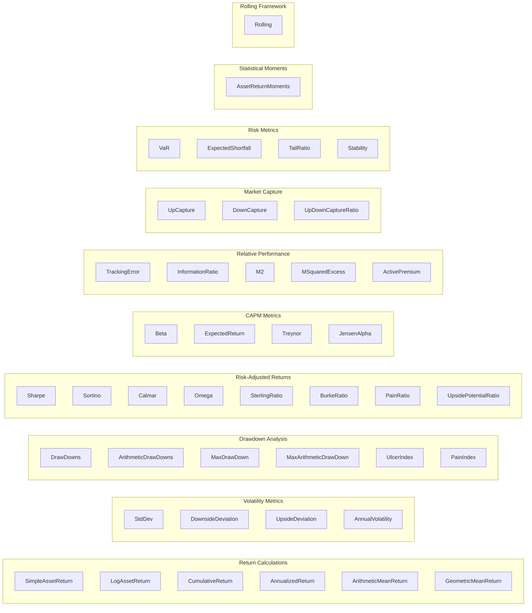
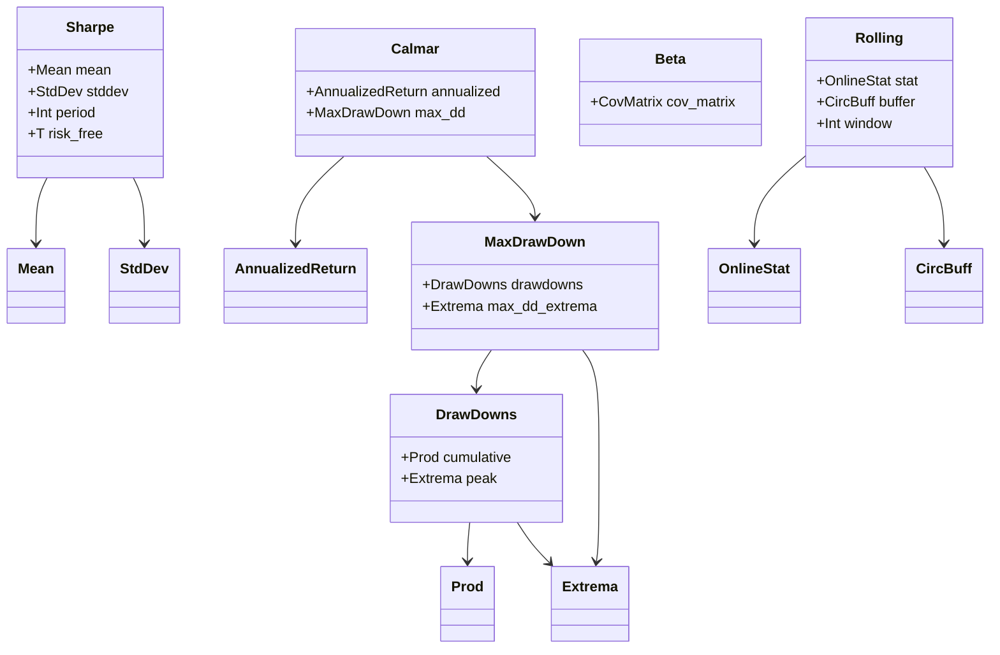
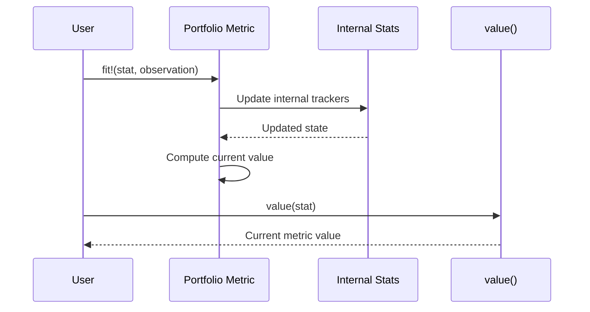
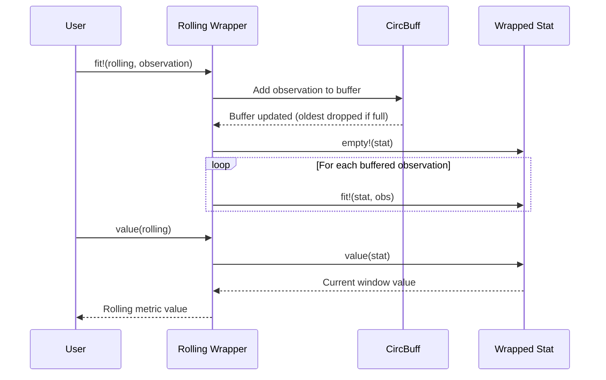
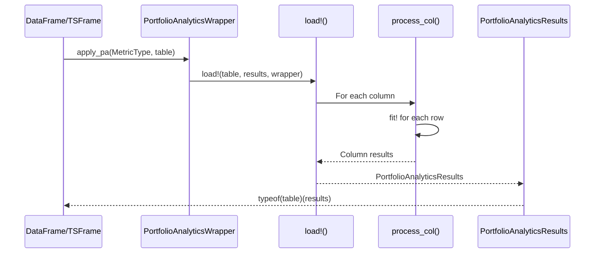
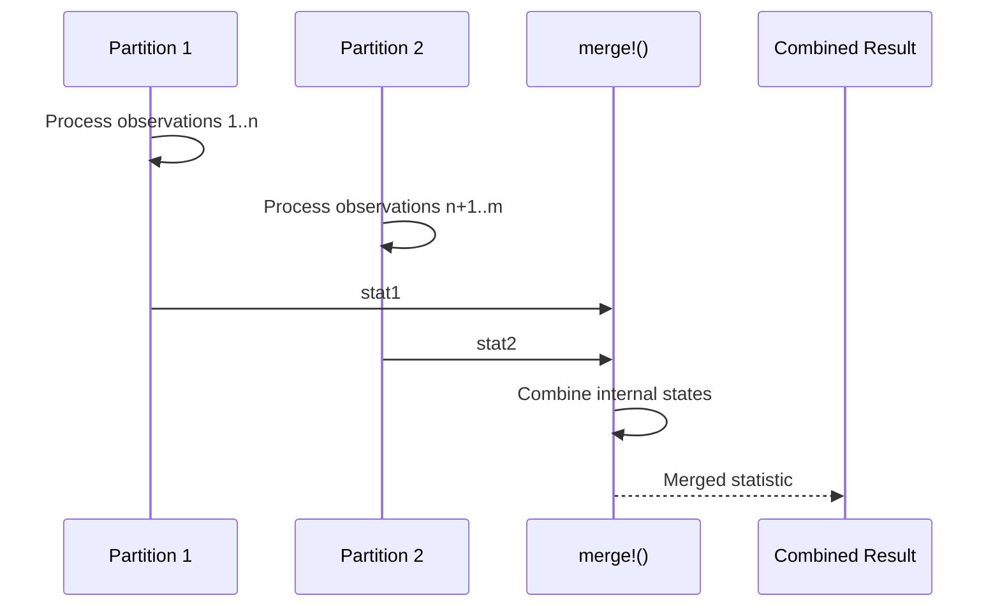
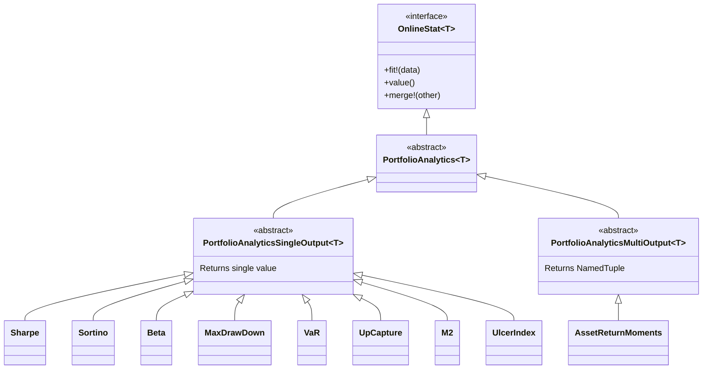

# OnlinePortfolioAnalytics.jl - Technical Documentation

> Streaming portfolio analytics using online algorithms for Julia

## Table of Contents

- [Project Overview](#project-overview)
- [Architecture](#architecture)
- [Project Structure](#project-structure)
- [Core Components](#core-components)
- [Data Flow](#data-flow)
- [Type Hierarchy](#type-hierarchy)
- [API Reference](#api-reference)
- [Configuration](#configuration)
- [Getting Started](#getting-started)
- [Development Guide](#development-guide)

---

## Project Overview

**OnlinePortfolioAnalytics.jl** is a Julia package (v0.2.0) that provides streaming portfolio analytics using [online algorithms](https://en.wikipedia.org/wiki/Online_algorithm). Online algorithms process data incrementally, one observation at a time, without storing the full history in memory.

### Tech Stack

| Component | Technology | Purpose |
|-----------|------------|---------|
| Language | Julia 1.6+ | Core implementation |
| Online Stats | OnlineStatsBase 1.x | Base types and interface |
| Advanced Stats | OnlineStats 1.x | CovMatrix, Quantile algorithms |
| Statistics | Statistics (stdlib) | Mean, std functions |
| Extended Stats | StatsBase 0.34.3 | Skewness, kurtosis |
| Documentation | DocStringExtensions 0.9.3 | TYPEDEF, LICENSE macros |
| Tables | Tables.jl 1.x | DataFrame integration |

### Key Features

- **Memory Efficient**: Process unlimited data streams with constant memory
- **Real-time Analytics**: Update statistics incrementally as data arrives
- **Composable**: Complex metrics built from simpler online statistics
- **Parallelizable**: Merge operations support distributed computation
- **Tables.jl Integration**: Works seamlessly with DataFrames and TSFrames
- **Rolling Windows**: Generic rolling window framework for any metric
- **40+ Portfolio Metrics**: Comprehensive coverage from basic returns to advanced risk measures

### Dependencies

```toml
[deps]
OnlineStatsBase = "925886fa-5bf2-5e8e-b522-a9147a512338"
OnlineStats = "a15396b6-48d5-5d58-9928-6d29437db91e"
Statistics = "10745b16-79ce-11e8-11f9-7d13ad32a3b2"
StatsBase = "2913bbd2-ae8a-5f71-8c99-4fb6c76f3a91"
DocStringExtensions = "ffbed154-4ef7-542d-bbb7-c09d3a79fcae"
Tables = "bd369af6-aec1-5ad0-b16a-f7cc5008161c"
Dates = "ade2ca70-3891-5945-98fb-dc099432e06a"
```

---

## Architecture

### High-Level Architecture



### Metric Categories



---

## Project Structure

```
OnlinePortfolioAnalytics/
├── src/
│   ├── OnlinePortfolioAnalytics.jl  # Main module (exports, includes)
│   ├── integrations/
│   │   └── tables.jl                # Tables.jl integration
│   │
│   ├── # Return Calculations
│   ├── asset_return.jl              # SimpleAssetReturn, LogAssetReturn
│   ├── cumulative_return.jl         # CumulativeReturn
│   ├── annualized_return.jl         # AnnualizedReturn
│   ├── mean_return.jl               # ArithmeticMeanReturn, GeometricMeanReturn
│   │
│   ├── # Volatility
│   ├── std_dev.jl                   # StdDev
│   ├── downside_deviation.jl        # DownsideDeviation
│   ├── upside_deviation.jl          # UpsideDeviation
│   ├── annual_volatility.jl         # AnnualVolatility
│   │
│   ├── # Drawdowns
│   ├── drawdowns.jl                 # DrawDowns, ArithmeticDrawDowns
│   ├── max_drawdown.jl              # MaxDrawDown, MaxArithmeticDrawDown
│   ├── ulcer_index.jl               # UlcerIndex
│   ├── pain_index.jl                # PainIndex
│   │
│   ├── # Risk-Adjusted Ratios
│   ├── sharpe.jl                    # Sharpe ratio
│   ├── sortino.jl                   # Sortino ratio
│   ├── calmar.jl                    # Calmar ratio
│   ├── omega.jl                     # Omega ratio
│   ├── sterling_ratio.jl            # Sterling ratio
│   ├── burke_ratio.jl               # Burke ratio
│   ├── pain_ratio.jl                # Pain ratio
│   ├── upside_potential_ratio.jl    # Upside Potential Ratio
│   │
│   ├── # CAPM Metrics
│   ├── asset_benchmark_return.jl    # AssetBenchmarkReturn wrapper
│   ├── beta.jl                      # Beta coefficient
│   ├── expected_return.jl           # CAPM Expected Return
│   ├── treynor.jl                   # Treynor ratio
│   ├── jensen_alpha.jl              # Jensen's Alpha
│   │
│   ├── # Relative Performance
│   ├── tracking_error.jl            # Tracking Error
│   ├── information_ratio.jl         # Information Ratio
│   ├── m2.jl                        # M2 (Modigliani-Modigliani)
│   ├── m_squared_excess.jl          # M-Squared Excess
│   ├── active_premium.jl            # Active Premium
│   │
│   ├── # Market Capture
│   ├── up_capture.jl                # Up Capture Ratio
│   ├── down_capture.jl              # Down Capture Ratio
│   ├── up_down_capture_ratio.jl     # Up/Down Capture Ratio
│   │
│   ├── # Risk Metrics
│   ├── var.jl                       # Value at Risk
│   ├── expected_shortfall.jl        # Expected Shortfall (CVaR)
│   ├── tail_ratio.jl                # Tail Ratio
│   ├── stability.jl                 # Return Stability (R²)
│   │
│   ├── # Statistical Moments
│   ├── moments.jl                   # AssetReturnMoments
│   │
│   ├── # Rolling Window Framework
│   ├── rolling.jl                   # Rolling wrapper
│   │
│   ├── # Utilities
│   ├── prod.jl                      # Product accumulator
│   └── sample_data.jl               # Sample TSLA, NFLX, MSFT data
│
├── test/
│   ├── runtests.jl                  # Test entry point (TestItemRunner)
│   ├── setup.jl                     # Common test setup (@testsnippet)
│   └── test_*.jl                    # Individual test files (41 total)
│
├── docs/
│   └── make.jl                      # Documenter.jl build script
│
├── examples/
│   └── notebooks/                   # Jupyter notebook examples
│
├── Project.toml                     # Dependencies
├── Manifest.toml                    # Lock file
├── README.md                        # Project overview
├── WIKI.md                          # This documentation
└── CLAUDE.md                        # Development guidelines
```

---

## Core Components

### OnlineStatsBase Interface

All types implement the standard OnlineStatsBase interface:

```julia
# Core functions
fit!(stat, observation)  # Update statistic with new observation
value(stat)              # Get current value
empty!(stat)             # Reset to initial state
merge!(stat1, stat2)     # Combine statistics (for parallel computation)
```

### Input Types

#### Scalar Returns
Most metrics accept scalar return values directly:

```julia
stat = Sharpe{Float64}()
fit!(stat, 0.05)   # 5% return
fit!(stat, -0.02)  # -2% return
```

#### AssetBenchmarkReturn
For relative/CAPM metrics, use paired observations:

```julia
struct AssetBenchmarkReturn{T<:Real}
    asset::T      # Asset/portfolio return
    benchmark::T  # Benchmark/market return
end

# Usage
stat = Beta{Float64}()
fit!(stat, AssetBenchmarkReturn(0.05, 0.03))  # Asset +5%, Market +3%
```

### Composition Pattern

Complex metrics compose simpler online statistics:



---

## Data Flow

### Single Observation Processing



### Rolling Window Processing



### Tables.jl Integration Flow



### Parallel Merge Flow



---

## Type Hierarchy



---

## API Reference

### Return Calculations

| Type | Input | Output | Description |
|------|-------|--------|-------------|
| `SimpleAssetReturn{T}` | Prices | `(Pt - Pt-k) / Pt-k` | Arithmetic returns |
| `LogAssetReturn{T}` | Prices | `ln(Pt / Pt-k)` | Log returns |
| `CumulativeReturn{T}` | Returns | `prod(1 + Ri)` | Geometric cumulative |
| `AnnualizedReturn{T}` | Returns | CAGR | Annualized return |
| `ArithmeticMeanReturn{T}` | Returns | `sum(Ri) / n` | Simple average |
| `GeometricMeanReturn{T}` | Returns | `(prod(1+Ri))^(1/n) - 1` | Geometric mean |

### Volatility Metrics

| Type | Input | Output | Description |
|------|-------|--------|-------------|
| `StdDev{T}` | Returns | `sigma` | Standard deviation |
| `DownsideDeviation{T}` | Returns | `sigma_down` | Semi-deviation below threshold |
| `UpsideDeviation{T}` | Returns | `sigma_up` | Semi-deviation above threshold |
| `AnnualVolatility{T}` | Returns | `sigma * sqrt(period)` | Annualized volatility |

### Drawdown Analysis

| Type | Input | Output | Description |
|------|-------|--------|-------------|
| `DrawDowns{T}` | Returns | Current DD | Geometric drawdown |
| `ArithmeticDrawDowns{T}` | Returns | Current DD | Arithmetic drawdown |
| `MaxDrawDown{T}` | Returns | Min DD | Worst geometric drawdown |
| `MaxArithmeticDrawDown{T}` | Returns | Min DD | Worst arithmetic drawdown |
| `UlcerIndex{T}` | Returns | RMS(DD) | Root-mean-square of drawdowns |
| `PainIndex{T}` | Returns | Mean(\|DD\|) | Mean absolute drawdown |

### Risk-Adjusted Ratios

| Type | Formula | Parameters |
|------|---------|------------|
| `Sharpe{T}` | `sqrt(T) * (E[R] - rf) / sigma` | `period=252`, `risk_free=0` |
| `Sortino{T}` | `sqrt(T) * (E[R] - rf) / sigma_down` | `period=252`, `risk_free=0` |
| `Calmar{T}` | `AnnualizedReturn / abs(MaxDD)` | `period=252` |
| `Omega{T}` | Probability ratio above threshold | `threshold=0` |
| `SterlingRatio{T}` | `AnnualizedReturn / (abs(AvgDD) + 10%)` | `period=252` |
| `BurkeRatio{T}` | `AnnualizedReturn / sqrt(sum(DD²))` | `period=252` |
| `PainRatio{T}` | `AnnualizedReturn / PainIndex` | `period=252` |
| `UpsidePotentialRatio{T}` | `E[max(R-MAR,0)] / DownsideDeviation` | `mar=0` |

### CAPM Metrics

| Type | Formula | Input |
|------|---------|-------|
| `Beta{T}` | `Cov(Ra, Rm) / Var(Rm)` | `AssetBenchmarkReturn` |
| `ExpectedReturn{T}` | `rf + beta(E[Rm] - rf)` | `AssetBenchmarkReturn` |
| `Treynor{T}` | `(E[R] - rf) / beta` | `AssetBenchmarkReturn` |
| `JensenAlpha{T}` | `E[R] - (rf + beta(E[Rm] - rf))` | `AssetBenchmarkReturn` |

### Relative Performance

| Type | Formula | Input |
|------|---------|-------|
| `TrackingError{T}` | `sigma(Ra - Rb)` | `AssetBenchmarkReturn` |
| `InformationRatio{T}` | `E[Ra - Rb] / sigma(Ra - Rb)` | `AssetBenchmarkReturn` |
| `M2{T}` | `Rf + (Rp - Rf) * (σb / σp)` | `AssetBenchmarkReturn` |
| `MSquaredExcess{T}` | `M2 - E[Rb]` | `AssetBenchmarkReturn` |
| `ActivePremium{T}` | `AnnualizedReturn(port) - AnnualizedReturn(bench)` | `AssetBenchmarkReturn` |

### Market Capture Ratios

| Type | Formula | Input | Interpretation |
|------|---------|-------|----------------|
| `UpCapture{T}` | Geometric mean ratio (up periods) | `AssetBenchmarkReturn` | >1 = outperforms in up markets |
| `DownCapture{T}` | Geometric mean ratio (down periods) | `AssetBenchmarkReturn` | <1 = loses less in down markets |
| `UpDownCaptureRatio{T}` | `UpCapture / DownCapture` | `AssetBenchmarkReturn` | >1 = favorable asymmetry |

### Risk Metrics

| Type | Description | Parameters |
|------|-------------|------------|
| `VaR{T}` | Value at Risk at confidence level | `alpha=0.05` |
| `ExpectedShortfall{T}` | Expected loss beyond VaR | `alpha=0.05` |
| `TailRatio{T}` | `P95 / abs(P5)` | `b=500` (histogram bins) |
| `Stability{T}` | R² of cumulative log returns | - |

### Statistical Moments

| Type | Output | Description |
|------|--------|-------------|
| `AssetReturnMoments{T}` | `NamedTuple(mean, std, skewness, kurtosis)` | All four moments |

### Rolling Window Framework

| Type | Description | Parameters |
|------|-------------|------------|
| `Rolling{T,S}` | Wrap any OnlineStat for rolling window | `stat`, `window` |

```julia
# Examples
Rolling(Sharpe{Float64}(), window=60)     # 60-period rolling Sharpe
Rolling(MaxDrawDown{Float64}(), window=30) # 30-period rolling max DD
Rolling(Calmar{Float64}(), window=252)     # 1-year rolling Calmar
```

---

## Configuration

### Annualization Periods

Default period is 252 (daily trading days):

| Frequency | Period Value |
|-----------|--------------|
| Daily | 252 |
| Weekly | 52 |
| Monthly | 12 |
| Hourly | 252 x 6.5 = 1638 |

```julia
# Configure for monthly data
sharpe = Sharpe{Float64}(period=12, risk_free=0.001)
```

### Risk-Free Rate

Specify per-period risk-free rate:

```julia
# 2% annual risk-free rate for daily data
rf_daily = 0.02 / 252
sharpe = Sharpe{Float64}(risk_free=rf_daily)
```

### Thresholds

Various metrics accept threshold parameters:

```julia
# Downside deviation with 0% threshold
dd = DownsideDeviation{Float64}(threshold=0.0)

# Sortino with custom minimum acceptable return
sortino = Sortino{Float64}(mar=0.001)

# Omega with custom threshold
omega = Omega{Float64}(threshold=0.0)

# VaR at 99% confidence (1% alpha)
var = VaR{Float64}(alpha=0.01)
```

---

## Getting Started

### Installation

```julia
using Pkg
Pkg.add("OnlinePortfolioAnalytics")
```

### Basic Usage

```julia
using OnlinePortfolioAnalytics

# Create a Sharpe ratio tracker
sharpe = Sharpe{Float64}(period=252, risk_free=0.0)

# Stream daily returns
returns = [0.01, -0.02, 0.015, 0.005, -0.01]
for r in returns
    fit!(sharpe, r)
    println("Current Sharpe: ", value(sharpe))
end
```

### Using with DataFrames

```julia
using OnlinePortfolioAnalytics
using DataFrames

# Create sample data
df = DataFrame(
    Date = Date(2024,1,1):Day(1):Date(2024,1,10),
    AAPL = rand(10) .* 0.02 .- 0.01,
    MSFT = rand(10) .* 0.02 .- 0.01
)

# Calculate Sharpe ratio for each column
result = Sharpe(df, period=252)
```

### CAPM Analysis

```julia
using OnlinePortfolioAnalytics

# Calculate Beta
beta = Beta{Float64}()

# Stream paired (asset, market) returns
observations = [
    AssetBenchmarkReturn(0.05, 0.03),
    AssetBenchmarkReturn(0.02, 0.01),
    AssetBenchmarkReturn(-0.01, -0.02)
]

for obs in observations
    fit!(beta, obs)
end

println("Beta: ", value(beta))
```

### Market Capture Analysis

```julia
using OnlinePortfolioAnalytics

# Calculate up/down capture ratios
up_cap = UpCapture{Float64}()
down_cap = DownCapture{Float64}()

observations = [
    AssetBenchmarkReturn(0.05, 0.03),   # Up market
    AssetBenchmarkReturn(-0.02, -0.04), # Down market
    AssetBenchmarkReturn(0.02, 0.01),   # Up market
    AssetBenchmarkReturn(-0.01, -0.03)  # Down market
]

for obs in observations
    fit!(up_cap, obs)
    fit!(down_cap, obs)
end

println("Up Capture: ", value(up_cap))    # How much of up moves captured
println("Down Capture: ", value(down_cap)) # How much of down moves captured
```

### Rolling Window Analysis

```julia
using OnlinePortfolioAnalytics

# Create rolling 60-period Sharpe ratio
rolling_sharpe = Rolling(Sharpe{Float64}(), window=60)

# Stream daily returns
for ret in daily_returns
    fit!(rolling_sharpe, ret)
    println("60-day rolling Sharpe: ", value(rolling_sharpe))
end

# Rolling 30-period max drawdown
rolling_dd = Rolling(MaxDrawDown{Float64}(), window=30)
for ret in returns
    fit!(rolling_dd, ret)
end
println("Rolling Max DD: ", value(rolling_dd))
```

### Parallel Computation

```julia
using OnlinePortfolioAnalytics

# Process partitions in parallel
partition1_returns = [0.01, 0.02, -0.01]
partition2_returns = [-0.02, 0.03, 0.01]

# Create separate stats for each partition
stat1 = MaxDrawDown{Float64}()
stat2 = MaxDrawDown{Float64}()

# Process partitions independently
for r in partition1_returns; fit!(stat1, r); end
for r in partition2_returns; fit!(stat2, r); end

# Merge results
merge!(stat1, stat2)
println("Combined Max Drawdown: ", value(stat1))
```

### Reactive Streams with Rocket.jl

```julia
using OnlinePortfolioAnalytics
using Rocket

# Create a Sharpe tracker
sharpe = Sharpe{Float64}()

# Create observable from returns
source = from([0.01, -0.02, 0.015, 0.005, -0.01])

# Subscribe and update
source |> subscribe!(
    on_next = (r) -> begin
        fit!(sharpe, r)
        println("Sharpe: ", value(sharpe))
    end
)
```

---

## Development Guide

### Running Tests

```bash
julia --project -e 'using Pkg; Pkg.test()'
```

### Test Structure

Tests use TestItemRunner/TestItems framework:

```julia
@testitem "Sharpe ratio calculation" setup=[CommonTestSetup] begin
    stat = Sharpe{Float64}()
    fit!(stat, 0.02)
    fit!(stat, -0.01)

    @test value(stat) ≈ expected_value atol=0.0001
end
```

### Test Setup

Common setup is defined in `test/setup.jl`:

```julia
@testsnippet CommonTestSetup begin
    using OnlinePortfolioAnalytics
    using OnlinePortfolioAnalytics.SampleData: dates, TSLA, NFLX, MSFT, weights
    using OnlineStatsBase
    using Test
    # ...
end
```

### Adding New Metrics

1. Create new file in `src/` (e.g., `src/new_metric.jl`)
2. Define type extending `PortfolioAnalyticsSingleOutput{T}` or `PortfolioAnalyticsMultiOutput{T}`
3. Implement required functions:
   - `OnlineStatsBase._fit!(stat, data)` - Update logic
   - `OnlineStatsBase.value(stat)` - Return current value
   - `Base.empty!(stat)` - Reset state
   - (Optional) `OnlineStatsBase._merge!(stat1, stat2)` - Parallel support
4. Add export in `OnlinePortfolioAnalytics.jl`
5. Include file in `OnlinePortfolioAnalytics.jl`
6. Add Tables.jl wrapper in `integrations/tables.jl` (if single-input)
7. Create test file in `test/`

### Example: Adding a New Metric

```julia
# src/my_metric.jl
@doc """
$(TYPEDEF)

    MyMetric{T}(; param=default)

Description of the metric.

# Mathematical Definition

``\\text{Formula} = ...``

# Fields

$(FIELDS)

# Example

```julia
stat = MyMetric{Float64}()
fit!(stat, 0.05)
value(stat)
```
"""
mutable struct MyMetric{T} <: PortfolioAnalyticsSingleOutput{T}
    "Current value"
    value::T
    "Number of observations"
    n::Int
    "Parameter"
    param::T

    function MyMetric{T}(; param::Real = zero(T)) where {T}
        new{T}(zero(T), 0, T(param))
    end
end

# Convenience constructor
MyMetric(; T::Type = Float64, param::Real = 0.0) = MyMetric{T}(param = T(param))

function OnlineStatsBase._fit!(stat::MyMetric{T}, ret) where {T}
    stat.n += 1
    # Update logic here
    stat.value = # compute value
end

function OnlineStatsBase.value(stat::MyMetric)
    return stat.value
end

function Base.empty!(stat::MyMetric{T}) where {T}
    stat.value = zero(T)
    stat.n = 0
end
```

### Code Style

- Follow standard Julia conventions
- Use comprehensive docstrings with `$(TYPEDEF)` and `$(FIELDS)`
- Document mathematical definitions with LaTeX
- Include edge case handling
- Add cross-references with `See also:`
- Provide convenience constructors with sensible defaults

### Merge Support

For parallelizable metrics, implement `_merge!`:

```julia
function OnlineStatsBase._merge!(stat1::MyMetric, stat2::MyMetric)
    # Combine internal states algebraically
    merge!(stat1.internal_stat, stat2.internal_stat)
    stat1.n += stat2.n

    # Recalculate value from merged state
    stat1.value = compute_value(stat1)

    return stat1
end
```

---

## Exported Types Summary

### Core Types
- `PortfolioAnalytics{T}` - Abstract base type
- `PortfolioAnalyticsSingleOutput{T}` - Single value output
- `PortfolioAnalyticsMultiOutput{T}` - NamedTuple output
- `AssetBenchmarkReturn{T}` - Paired asset/benchmark data

### Return Metrics
- `SimpleAssetReturn`, `LogAssetReturn`
- `CumulativeReturn`, `AnnualizedReturn`
- `ArithmeticMeanReturn`, `GeometricMeanReturn`

### Volatility Metrics
- `StdDev`, `DownsideDeviation`, `UpsideDeviation`
- `AnnualVolatility`

### Drawdown Metrics
- `DrawDowns`, `ArithmeticDrawDowns`
- `MaxDrawDown`, `MaxArithmeticDrawDown`
- `UlcerIndex`, `PainIndex`

### Risk-Adjusted Ratios
- `Sharpe`, `Sortino`, `Calmar`, `Omega`
- `SterlingRatio`, `BurkeRatio`, `PainRatio`
- `UpsidePotentialRatio`

### CAPM Metrics
- `Beta`, `ExpectedReturn`, `Treynor`, `JensenAlpha`

### Relative Performance
- `TrackingError`, `InformationRatio`
- `M2`, `MSquaredExcess`, `ActivePremium`

### Market Capture
- `UpCapture`, `DownCapture`, `UpDownCaptureRatio`

### Risk Metrics
- `VaR`, `ExpectedShortfall`
- `TailRatio`, `Stability`

### Statistical Moments
- `AssetReturnMoments`

### Rolling Framework
- `Rolling`

### Functions
- `fit!` - Update statistic with observation
- `value` - Get current value

---

## References

- [OnlineStatsBase.jl](https://github.com/joshday/OnlineStats.jl) - Base types and interface
- [OnlineStats.jl](https://github.com/joshday/OnlineStats.jl) - CovMatrix, Quantile
- [Tables.jl](https://github.com/JuliaData/Tables.jl) - Table interface
- [empyrical](https://github.com/quantopian/empyrical) - Python reference implementation
- [PerformanceAnalytics](https://cran.r-project.org/web/packages/PerformanceAnalytics/) - R reference

---

*Generated for OnlinePortfolioAnalytics.jl v0.2.0*
