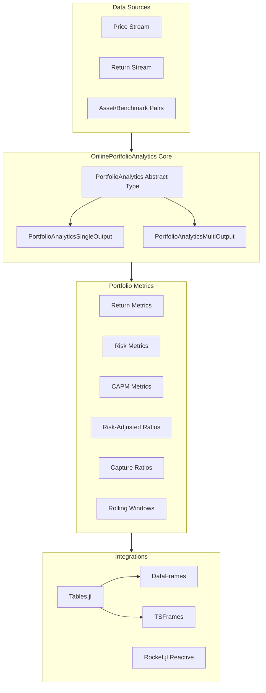

# Architecture

This page provides a high-level overview of the OnlinePortfolioAnalytics.jl architecture, showing how data flows through the system and how components are organized.

## High-Level Architecture

The diagram below shows the main components of OnlinePortfolioAnalytics and how they interact:

### Component Overview

- **Data Sources**: The package accepts three types of input data:
  - **Price Stream**: Raw asset prices that can be converted to returns
  - **Return Stream**: Pre-calculated periodic returns
  - **Asset/Benchmark Pairs**: Paired observations for relative metrics (e.g., Beta, Tracking Error)

- **Core Types**: All analytics inherit from the `PortfolioAnalytics` abstract type:
  - **PortfolioAnalyticsSingleOutput**: Metrics that return a single scalar value (e.g., Sharpe ratio)
  - **PortfolioAnalyticsMultiOutput**: Metrics that return a NamedTuple (e.g., AssetReturnMoments)

- **Portfolio Metrics**: The package provides 40+ metrics organized into categories:
  - Return calculations, volatility, drawdown analysis
  - Risk-adjusted ratios, CAPM metrics, relative performance
  - Market capture ratios, risk metrics, rolling windows

- **Integrations**: Seamless integration with the Julia data ecosystem:
  - **Tables.jl**: Works with any Tables.jl-compatible data source
  - **DataFrames**: Direct support for DataFrame operations
  - **TSFrames**: Time series support
  - **Rocket.jl**: Reactive stream processing

## Key Design Principles

1. **Online Algorithms**: All metrics process data incrementally using the `fit!` function, enabling constant-memory operation on unlimited data streams.

2. **Composability**: Complex metrics are built by composing simpler online statistics (e.g., Sharpe ratio composes Mean and StdDev).

3. **Parallelizability**: The `merge!` operation supports distributed computation by combining statistics from different data partitions.

4. **Type Safety**: Metrics are parameterized by their input type `T`, ensuring type stability and optimal performance.

See the Internals page for detailed diagrams of the type hierarchy and data flow patterns.
