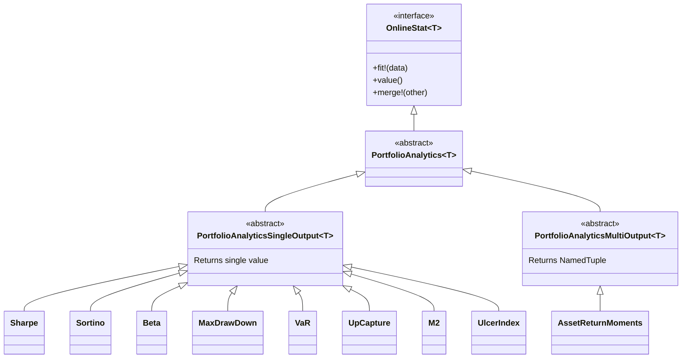
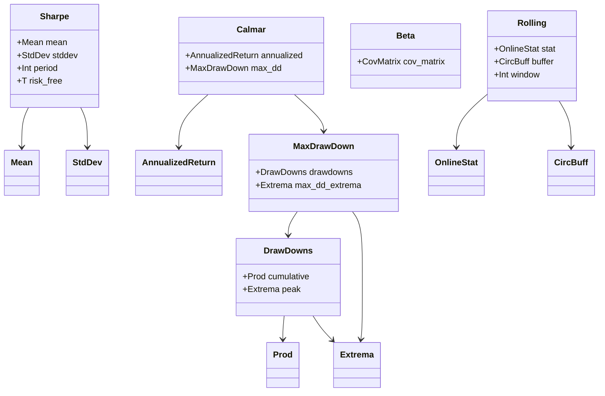
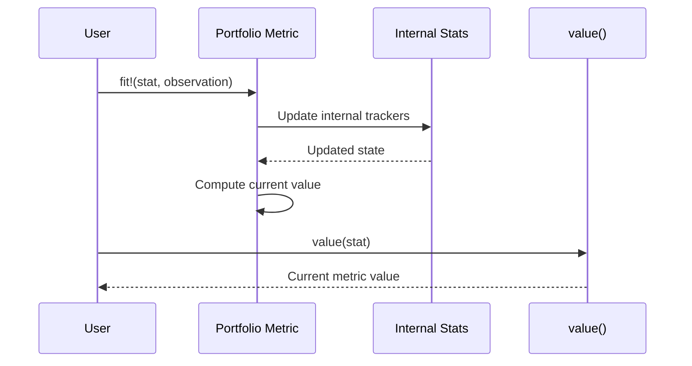
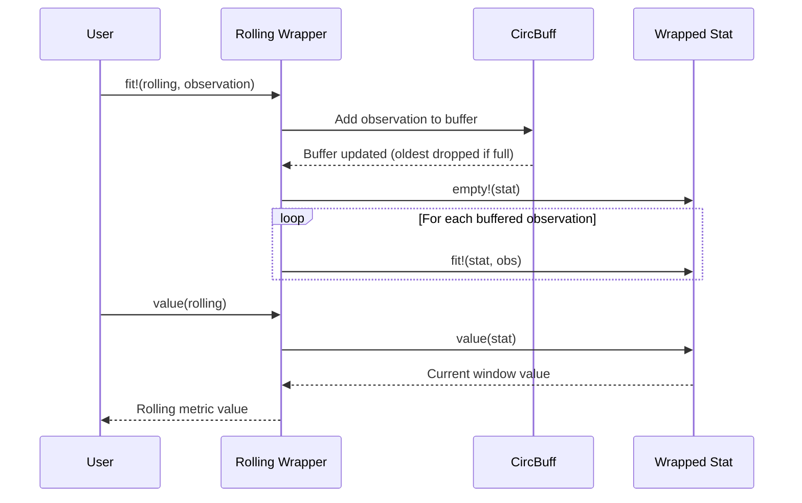

# Internals

This page provides detailed technical documentation for contributors and users who want to understand the internal design of OnlinePortfolioAnalytics.jl.

## Type Hierarchy

All analytics in OnlinePortfolioAnalytics inherit from the `OnlineStat{T}` interface provided by OnlineStatsBase.jl:



### Type Categories

- **PortfolioAnalyticsSingleOutput{T}**: Metrics that return a single scalar value (e.g., Sharpe ratio returns a `Float64`)
- **PortfolioAnalyticsMultiOutput{T}**: Metrics that return a NamedTuple with multiple values (e.g., AssetReturnMoments returns `(mean, std, skewness, kurtosis)`)

## Composition Pattern

Complex metrics are built by composing simpler online statistics. This enables code reuse and ensures numerical stability:



### Key Composition Examples

- **Sharpe** composes `Mean` and `StdDev` to compute risk-adjusted returns
- **Calmar** composes `AnnualizedReturn` and `MaxDrawDown` to compute the Calmar ratio
- **MaxDrawDown** composes `DrawDowns` and `Extrema` to track the worst drawdown
- **Rolling** wraps any `OnlineStat` with a `CircBuff` (circular buffer) for rolling window calculations

## Data Flow

### Single Observation Processing

When you call `fit!` with a new observation, here's what happens:



### Rolling Window Processing

Rolling window metrics maintain a buffer of recent observations:



## OnlineStatsBase Interface

All types implement the standard OnlineStatsBase interface:

```julia
# Core functions
fit!(stat, observation)  # Update statistic with new observation
value(stat)              # Get current value
empty!(stat)             # Reset to initial state
merge!(stat1, stat2)     # Combine statistics (for parallel computation)
```

### Input Types

#### Scalar Returns
Most metrics accept scalar return values directly:

```julia
stat = Sharpe{Float64}()
fit!(stat, 0.05)   # 5% return
fit!(stat, -0.02)  # -2% return
```

#### AssetBenchmarkReturn
For relative/CAPM metrics, use paired observations:

```julia
struct AssetBenchmarkReturn{T<:Real}
    asset::T      # Asset/portfolio return
    benchmark::T  # Benchmark/market return
end

# Usage
stat = Beta{Float64}()
fit!(stat, AssetBenchmarkReturn(0.05, 0.03))  # Asset +5%, Market +3%
```

## Adding New Metrics

To add a new metric, follow this pattern:

1. Create a new file in `src/` (e.g., `src/my_metric.jl`)
2. Define a struct extending `PortfolioAnalyticsSingleOutput{T}` or `PortfolioAnalyticsMultiOutput{T}`
3. Implement required functions:
   - `OnlineStatsBase._fit!(stat, data)` - Update logic
   - `OnlineStatsBase.value(stat)` - Return current value
   - `Base.empty!(stat)` - Reset state
   - (Optional) `OnlineStatsBase._merge!(stat1, stat2)` - Parallel support
4. Add export in `OnlinePortfolioAnalytics.jl`
5. Include file in `OnlinePortfolioAnalytics.jl`
6. Create test file in `test/`

See the API page for the full list of available metrics.
