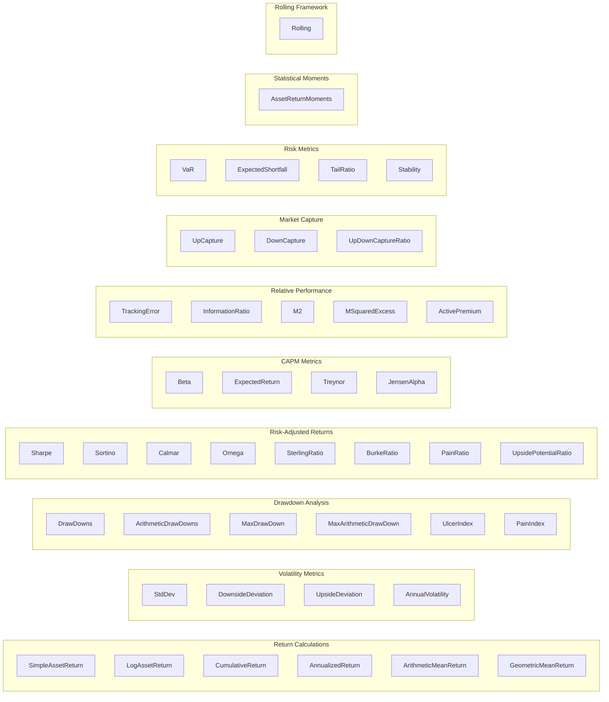

# Metrics Reference

This page provides a visual overview of all available metrics organized by category, along with detailed reference tables.

## Metric Categories

The diagram below shows the complete set of portfolio metrics organized by category:



## API Reference Tables

### Return Calculations

| Type | Input | Output | Description |
|------|-------|--------|-------------|
| `SimpleAssetReturn{T}` | Prices | `(Pt - Pt-k) / Pt-k` | Arithmetic returns |
| `LogAssetReturn{T}` | Prices | `ln(Pt / Pt-k)` | Log returns |
| `CumulativeReturn{T}` | Returns | `prod(1 + Ri)` | Geometric cumulative |
| `AnnualizedReturn{T}` | Returns | CAGR | Annualized return |
| `ArithmeticMeanReturn{T}` | Returns | `sum(Ri) / n` | Simple average |
| `GeometricMeanReturn{T}` | Returns | `(prod(1+Ri))^(1/n) - 1` | Geometric mean |

### Volatility Metrics

| Type | Input | Output | Description |
|------|-------|--------|-------------|
| `StdDev{T}` | Returns | `sigma` | Standard deviation |
| `DownsideDeviation{T}` | Returns | `sigma_down` | Semi-deviation below threshold |
| `UpsideDeviation{T}` | Returns | `sigma_up` | Semi-deviation above threshold |
| `AnnualVolatility{T}` | Returns | `sigma * sqrt(period)` | Annualized volatility |

### Drawdown Analysis

| Type | Input | Output | Description |
|------|-------|--------|-------------|
| `DrawDowns{T}` | Returns | Current DD | Geometric drawdown |
| `ArithmeticDrawDowns{T}` | Returns | Current DD | Arithmetic drawdown |
| `MaxDrawDown{T}` | Returns | Min DD | Worst geometric drawdown |
| `MaxArithmeticDrawDown{T}` | Returns | Min DD | Worst arithmetic drawdown |
| `UlcerIndex{T}` | Returns | RMS(DD) | Root-mean-square of drawdowns |
| `PainIndex{T}` | Returns | Mean(\|DD\|) | Mean absolute drawdown |

### Risk-Adjusted Ratios

| Type | Formula | Parameters |
|------|---------|------------|
| `Sharpe{T}` | `sqrt(T) * (E[R] - rf) / sigma` | `period=252`, `risk_free=0` |
| `Sortino{T}` | `sqrt(T) * (E[R] - rf) / sigma_down` | `period=252`, `risk_free=0` |
| `Calmar{T}` | `AnnualizedReturn / abs(MaxDD)` | `period=252` |
| `Omega{T}` | Probability ratio above threshold | `threshold=0` |
| `SterlingRatio{T}` | `AnnualizedReturn / (abs(AvgDD) + 10%)` | `period=252` |
| `BurkeRatio{T}` | `AnnualizedReturn / sqrt(sum(DD²))` | `period=252` |
| `PainRatio{T}` | `AnnualizedReturn / PainIndex` | `period=252` |
| `UpsidePotentialRatio{T}` | `E[max(R-MAR,0)] / DownsideDeviation` | `mar=0` |

### CAPM Metrics

| Type | Formula | Input |
|------|---------|-------|
| `Beta{T}` | `Cov(Ra, Rm) / Var(Rm)` | `AssetBenchmarkReturn` |
| `ExpectedReturn{T}` | `rf + beta(E[Rm] - rf)` | `AssetBenchmarkReturn` |
| `Treynor{T}` | `(E[R] - rf) / beta` | `AssetBenchmarkReturn` |
| `JensenAlpha{T}` | `E[R] - (rf + beta(E[Rm] - rf))` | `AssetBenchmarkReturn` |

### Relative Performance

| Type | Formula | Input |
|------|---------|-------|
| `TrackingError{T}` | `sigma(Ra - Rb)` | `AssetBenchmarkReturn` |
| `InformationRatio{T}` | `E[Ra - Rb] / sigma(Ra - Rb)` | `AssetBenchmarkReturn` |
| `M2{T}` | `Rf + (Rp - Rf) * (σb / σp)` | `AssetBenchmarkReturn` |
| `MSquaredExcess{T}` | `M2 - E[Rb]` | `AssetBenchmarkReturn` |
| `ActivePremium{T}` | `AnnualizedReturn(port) - AnnualizedReturn(bench)` | `AssetBenchmarkReturn` |

### Market Capture Ratios

| Type | Formula | Input | Interpretation |
|------|---------|-------|----------------|
| `UpCapture{T}` | Geometric mean ratio (up periods) | `AssetBenchmarkReturn` | >1 = outperforms in up markets |
| `DownCapture{T}` | Geometric mean ratio (down periods) | `AssetBenchmarkReturn` | <1 = loses less in down markets |
| `UpDownCaptureRatio{T}` | `UpCapture / DownCapture` | `AssetBenchmarkReturn` | >1 = favorable asymmetry |

### Risk Metrics

| Type | Description | Parameters |
|------|-------------|------------|
| `VaR{T}` | Value at Risk at confidence level | `alpha=0.05` |
| `ExpectedShortfall{T}` | Expected loss beyond VaR | `alpha=0.05` |
| `TailRatio{T}` | `P95 / abs(P5)` | `b=500` (histogram bins) |
| `Stability{T}` | R² of cumulative log returns | - |

### Statistical Moments

| Type | Output | Description |
|------|--------|-------------|
| `AssetReturnMoments{T}` | `NamedTuple(mean, std, skewness, kurtosis)` | All four moments |

### Rolling Window Framework

| Type | Description | Parameters |
|------|-------------|------------|
| `Rolling{T,S}` | Wrap any OnlineStat for rolling window | `stat`, `window` |

```julia
# Examples
Rolling(Sharpe{Float64}(), window=60)     # 60-period rolling Sharpe
Rolling(MaxDrawDown{Float64}(), window=30) # 30-period rolling max DD
Rolling(Calmar{Float64}(), window=252)     # 1-year rolling Calmar
```
